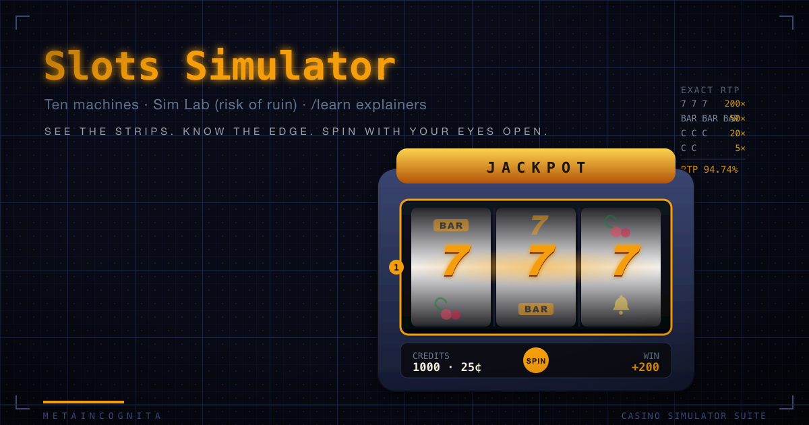

<p align="center">
  
</p>

# Metaincognita Slots

An educational slot machine simulator — part of the Metaincognita Casino
family (hold'em, video poker, craps, blackjack, flameout). Play authentic
machine archetypes, then see exactly what the casino never shows you: the
reel strips, the Telnaes virtual-reel weights, the engineered near-misses,
and the precise mathematics of the house edge.

**Status: v0.9.0.** The floor is open: ten machines, full game surfaces,
per-machine cabinet chrome, X-ray mode, PAR sheets, session history, a
Monte-Carlo Sim Lab, and /learn explainers on the math the floor never shows.

## Playing it

```bash
pnpm install
pnpm dev        # open http://localhost:3000
```

1. **Floor** — set a bankroll, then pick a machine from the family-grouped
   card grid. Each card shows the exact RTP and a one-line description.
2. **Machine** — spin, adjust your bet, watch the reels inside each
   machine's bespoke decorative cabinet chrome (ten themed frames: gothic
   stone, pachinko neon, baroque gold, emerald scales, riveted steel, ice
   facets, rising flames, warm brass, cool turquoise, green-felt card room).
   Hit **X-ray** to
   open the side panel: labeled RNG trace, near-miss callouts, a live
   session-vs-exact RTP convergence sparkline, and machine internals.
3. **PAR sheet** — click the spreadsheet icon for the full pay-table with
   the exact-math derivation: enumerated cycle counts, hit frequency, and
   variance.
4. **Pachislo keys** — on Stock Rush press **1/2/3** to stop reels manually;
   the slip (≤ 4 stops) is visible in X-ray.
5. **Sim Lab** — run thousands of bankroll sessions against any machine in a
   Web Worker (live progress, cancel mid-run). Outputs risk of ruin, median/mean
   ending bankroll, survival curve, drawdown histogram, sample trajectories, and
   empirical RTP.
6. **Learn** — four explainer pages covering house edge (live floor-wide table),
   Telnaes virtual-reel mechanics, hold-and-spin as an absorbing Markov chain,
   and the Gargoyle's Eye additive multiplier. Each page layers intuition first,
   then a collapsible rigorous derivation with live numbers.
7. Everything persists in **localStorage** — reload mid-feature and your
   free spins are still waiting exactly where you left them.

This is an educational simulator. No real money is involved.

## The floor

| Machine | Family | Format | Exact RTP |
|---|---|---|---|
| Diamond Doubler | Telnaes stepper | 3 reels, wild 2x/4x multiplier | 94.7442% |
| Sevens Ablaze | Telnaes stepper | 3 reels, 2-coin, percent-fed progressive | 94.4881% @ reset + 1%/coin-in feed |
| Series E 3-Line | Vintage Bally (E-1202 replica) | 5 reels x 22 uniform stops, 3 lines, dual toggling progressive | 89.0351% per line |
| Series E Multiplier | Vintage Bally (E-1203 replica) | 4 reels x 25 uniform stops, 1-3 coin multiplier | 89.1264% @ 3 coins / 85.0304% @ 1 |
| Canal Royale | Video (lines) | 5 reels x 24 stops, 25-line, free spins | 92.4559% |
| Dragon's Hoard | Video (ways) | 5 reels x 24 stops, 243-ways, free spins w/ retriggers | 93.9950% |
| Thunder Vault | Video (lines) | 5 reels x 24 stops, 25-line, Grand progressive | 90.2948% @ Grand reset |
| Ruby of Gargoyle | Video (lines) | 5 reels x 24 stops, 25-line, hold & spin, Gargoyle's Eye ×N multiplier, Grand progressive | 90.0802% @ Grand reset |
| Stock Rush | Pachislo (skill-stop) | 3 reels x 21 stops, flag lottery, stock queue | 66.0012%–120.0028% by operator level (L4 default 91.5013%) |
| Lucky 21 | Blackjack reel (stop-the-reels) | 5 card reels, STOP to lock each reel, additive multiplier cards, Five-Card Charlie, Blackjack Bonus double-or-nothing gamble | 90.0255% under optimal stopping |

Every RTP shown is **computed** from the machine definition by exact
enumeration (`exactRtp`) — never asserted — and verified by seeded
multi-million-spin simulation.

## Future variants

Planned machines (see `docs/superpowers/specs/2026-06-14-future-games-roadmap.md`):

- **Galactic Crash** — a pure crash / cash-out machine: four "climb" reels plus
  a separate fifth multiplier reel and two buttons (Spin / Cash Out). Each spin
  either survives and grows the running payout or crashes and forfeits the lot;
  your winnings stay fully at risk until you cash out, and the multiplier reel is
  the big-but-riskiest score. Distinct from pachislo skill-stop, where banked
  wins are protected — here everything rides until you bank it. RTP computed
  under optimal cash-out timing (the same exact-EV machinery as Lucky 21).
- **Authentic 4-tier progressives** — Mini/Minor/Major/Grand as scaling pools,
  generalizing the single-meter progressive system.

## Stepper (Telnaes virtual-reel)

Classic 3-reel cabinets with Telnaes virtual reels: each physical stop maps
to one or more virtual stops, giving the designer precise RTP control without
increasing the physical reel size. Diamond Doubler uses a wild symbol that
multiplies 2x/4x. Sevens Ablaze adds a percent-fed progressive whose meter
grows with every coin wagered.

## Bally E-series (electromechanical)

Uniform-stop mechanical reels with no virtual layer — the math is pure
combinatorics. The E-1202 pays three independent lines; the E-1203 uses a
1-3 coin multiplier. Both use the FO-5140 dual-toggling progressive
controller documented in the Bally service manuals.

## Video (lines / ways / hold-and-spin)

24-cell strips so the full 24⁵ cycle is exactly enumerable; line and ways
evaluation anchored on reel 1; free-spin EV via Wald/branching identities;
hold-and-spin via an absorbing Markov chain; Thunder Vault's Grand is a
percentage-fed progressive.

## Pachislo (skill-stop)

The lottery decides, the reels obey: flags stock and are never lost, control
slips ≤ 4 stops, and an exhaustive 21³ check proves no win can land without a
flag — so your timing changes *when*, never *how much*. Six operator odds
levels straight from the manual's bands (65–67% up to 115–125%).

## Blackjack reel (stop-the-reels)

Lucky 21 reimagines blackjack as a five-card stop-the-reels game. Ante a bet;
press **STOP** to lock each reel in sequence (or **CASH OUT** at any time to
bank your current hand value). No dealer — you play a scaling paytable by
final hand value (qualify at 15; 21 best, then 20/19/18; bust pays nothing).
Reels escalate in danger and reward 1→2→3→4→5: reels 1–2 are pure cards, reel
3 is the lock-in bonus (no cards — grab a **×multiplier** or −safe room over a
wall of BUST), and reels 4–5 bring cards back alongside bigger ×3/×5/×10
multipliers and more BUST.

A true 2-card natural (A + ten-value on reels 1–2) triggers the **Blackjack
Bonus**: a spinning chromed double-or-nothing reel. **STOP** for a fair 50/50
— land ×2 to double the amount on the line, land BUST to forfeit it. **CASH
OUT** keeps the guaranteed natural payout. The bonus is capped at 3 consecutive
doubles (a ladder shows your rung). The fair coin-flip EV equals the forfeited
amount, so the bonus is **RTP-neutral** — it adds pure variance with no house
edge contribution.

RTP is exact under **optimal stopping**: a backward-induction DP over the
decision state `(cards drawn, hard total, aces, multiplier sum)` enumerates
the full deck-depleted tree. Calibrated to 90.0255% (Five-Card Charlie ≈ 0.77%,
house edge ≈ 9.97%). A seeded simulate-under-optimal cross-check converges
within the 3.5σ band. The PAR sheet renders the DP-derived stop/cash-out
strategy table and exact bust / Five-Card-Charlie odds; X-ray shows the live
EV(stop) vs EV(cash) at each decision — the math the casino never shows.

## Per-machine cabinet chrome

Each machine's reel window sits inside a bespoke, gaudy, "weird-Vegas"
decorative frame built entirely from hand-crafted CSS and inline SVG
(no external images → CSP-clean, zero bundle weight). A `<GameMachineChrome>`
wrapper injects per-machine palette CSS variables and a radial stage backdrop,
then resolves the active machine's frame module from a registry. Unknown or
future machines fall back automatically to a clean accent-framed default, so
new games get chrome by adding one `.vue` file and one registry line.

The chrome layer is `aria-hidden` + `pointer-events:none` throughout — the
reels, controls, and engine are unaffected, and the a11y audit remains
100/100. All ambient animation (breathing glows, slow bobs, shimmer sweeps)
is suppressed by a single global `prefers-reduced-motion` media query guard.

## Verification

```bash
pnpm install
pnpm test          # unit + frozen-calibration + convergence suites
pnpm verify        # headless floor verification report (5M cycles/machine)
```

`pnpm verify` now covers 10 machines and prints a jackpot-column footnote
distinguishing progressive meter hits (Bally, Thunder Vault Grand) from
pachislo bonus flags. Convergence tests include video cycle-SE cases and
pachislo block-SE at levels 1/4/6.

CI also enforces engine purity: a grep over `app/engine/` confirms no UI
framework imports (`vue`, `nuxt`, `pinia`) have leaked into the headless
engine layer.

Full-run table (5M cycles/machine, seed 20260612):

```
machine               coins   exact RTP    sim RTP      Δ           HF exact     HF sim      jackpots  σ-band
canal-royale           25     92.4559%    92.3114%     0.1446%    55.5343%    55.5288%         0  PASS
dragons-hoard          25     93.9950%    93.8912%     0.1038%    53.5534%    53.5202%         0  PASS
thunder-vault          25     90.2948%    90.2476%     0.0471%    41.2899%    41.3153%       947  PASS
ruby-of-gargoyle       25     90.0802%    90.3199%     0.2397%    41.2899%    41.2930%      1007  PASS
diamond-doubler         3     94.7442%    94.6399%     0.1044%    14.6675%    14.6918%         0  PASS
sevens-ablaze           2     94.4881%    94.7558%     0.2677%    15.7193%    15.7390%       366  PASS
series-e-3line          1     89.0351%    89.1345%     0.0994%    11.8144%    11.8181%         2  PASS
series-e-multiplier     3     89.1264%    89.1293%     0.0029%    14.2559%    14.2621%       204  PASS
stock-rush              3     91.5013%    92.3172%     0.8159%    21.2341%    21.2290%         0  PASS
lucky-21                3     90.0255%    90.0172%     0.0083%    50.5893%    50.5801%         0  PASS
```

## Tech

Nuxt 4 SPA (ssr:false) - TypeScript strict - @nuxt/ui + Tailwind 4 -
Pinia - Vitest - Web Worker (Sim Lab) - pnpm. The engine (`app/engine/`) is
pure TypeScript with no framework imports; machines (`app/machines/`) are
pure data.

## Sources

Machine behavior is grounded in period documentation (see `docs/`): the
Bally Series E service manual (Fey, 1995), Bally Manual 7050 parts catalog
(1981, models E-1202/E-1203), the Bally FO-5140 Double Progressive
instructions (1989), Bally Manual 6000 (1979, electromechanical), the
Massachusetts Gaming Commission Slot Machine Activity Manual v8 (2022),
and a pachislo owner's manual (2006). Weighted virtual reels follow the
Telnaes patent (US 4,448,419, 1984). Reel strips and weights are original
designs calibrated to documented real-world targets.
